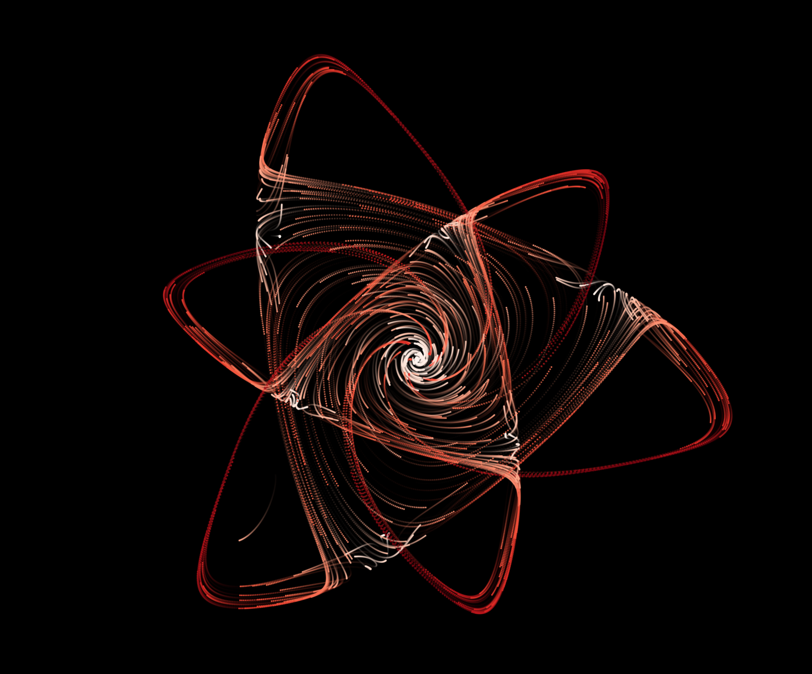
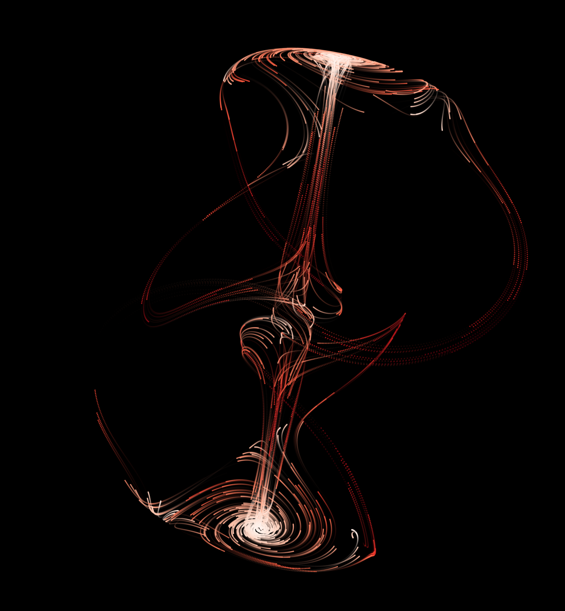

# Strange Attractors
This Repo contains demo code for visualizing strange attractors.

Click [here](media/demo.mp4) for a demo video of the Thomas Attractor.

## Running

    pyenv activate general
    pip install -e .
    python -m strange_attractors.demo

Further experiments can be made by running

    python -m strange_attractors.experiments

Check the code; existing attractors can be easily configured, and new ones can be implemented similar to [lorenz.py](src/strange_attractors/attractors/lorenz.py).
